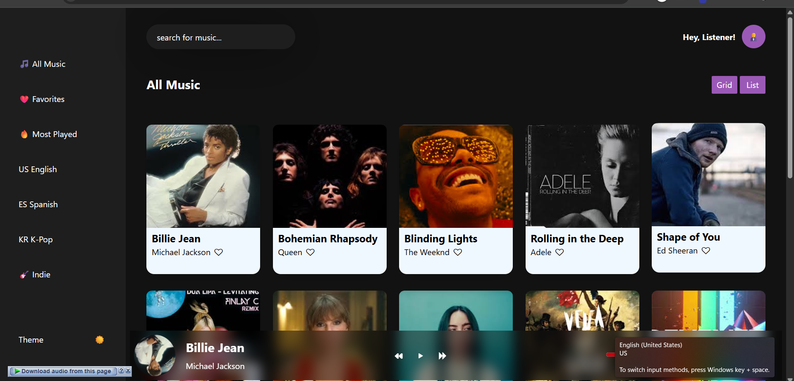

# Music Player

A simple interactive **Music Player** built using HTML, CSS, and JavaScript.


## Limitations
- **Not responsive**: Optimized only for **Asus gaming laptop screens**.
- Works best on modern browsers (Chrome, Firefox, Edge).

//////////////////////////////////////
## Demo



Live demo: [Music Player Demo](https://yourusername.github.io/your-repo-name/)

## Screenshot


## Features

- Play, pause, and switch between songs.
- Display song title, artist, and cover image.
- Song progress tracking.
- Clean UI design.

## Methods & Techniques Used

- **`setInterval`**: For updating song progress and timing.
- **`data-*` attributes**: Store song metadata (title, artist, cover, etc.).
- **`if` conditions**: Control play/pause states and handle logic.
- **DOM manipulation**: `document.querySelector`, `addEventListener`, `.innerHTML` for dynamic updates.


## How to Use

1. Clone the repository:
   ```bash
   git clone https://github.com/yourusername/your-repo-name.git
